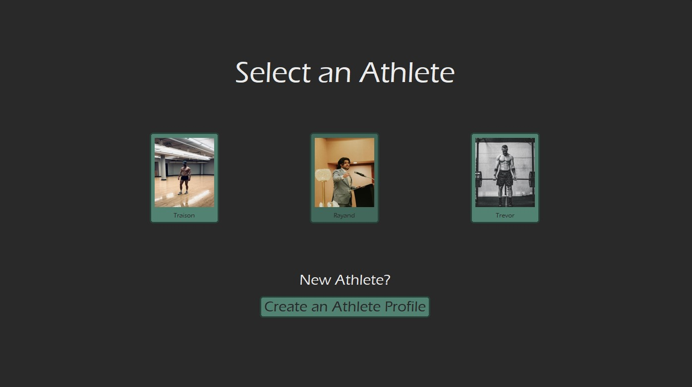
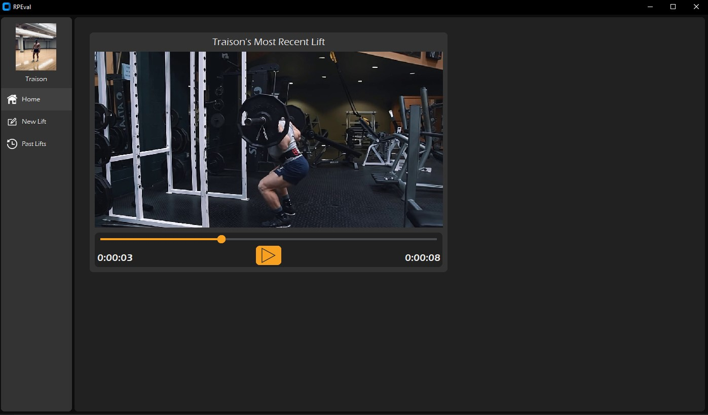
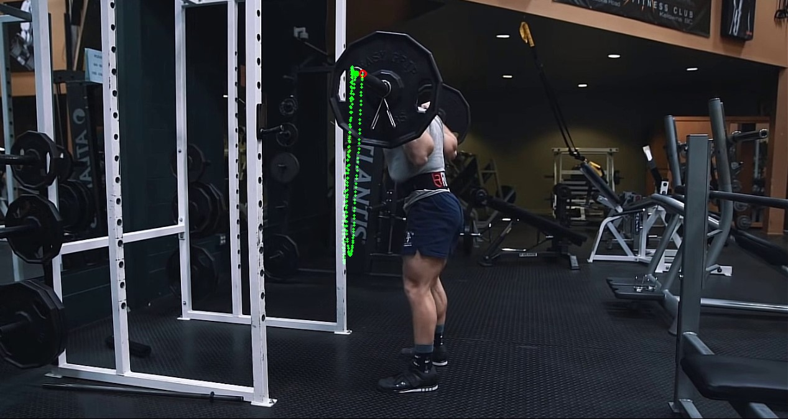

# RPEval

**This is a work-in-progress application**

## Description:
    The goal of this application is to create an environment
    where athletes are able to upload videos of themselves
    completing a set of a given exercise and then the
    application gives them a rate of perceived exertion(RPE) 
    estimate as well as information about the path consistency
    for their lift.

## Progress:
    As of the first commit, the ground work for the UI has begun
    with a customized video widget to display an athletes video.
    The object tracking method to be used for the rpeval algorithm
    has also begun development but has not yet been integrated

    
    
    

## TODO:
    - Finish the main 3 UI frames (Home, New Lifts, Past Lifts) 
        for the application
    - Implement a database acess layer and database implementation 
        using SQLite for athlete and video data
    - Integrate customizable object tracking into application

## Credits:
    - The UI uses customtkinter courtesy of Tom Schimansky
    - The [Object Tracking Method](https://mpolinowski.github.io/docs/IoT-and-Machine-Learning/ML/2021-12-10--opencv-optical-flow-tracking/2021-12-10/) (not yet implemented but results shown)
        was created by Mike Polinowski using opencv to implement
        Lucas-Kanade optical flow
    - The application features images (and sample videos in the near future) of
        [Trevor Diedrich](https://www.instagram.com/trevor_diedrich/) and [Rayan Ahmed](https://www.instagram.com/rayan.liv3s/) as example athletes